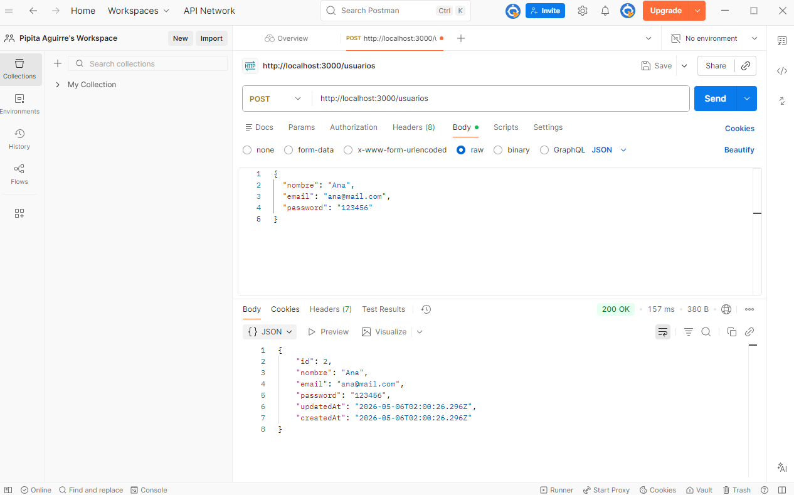
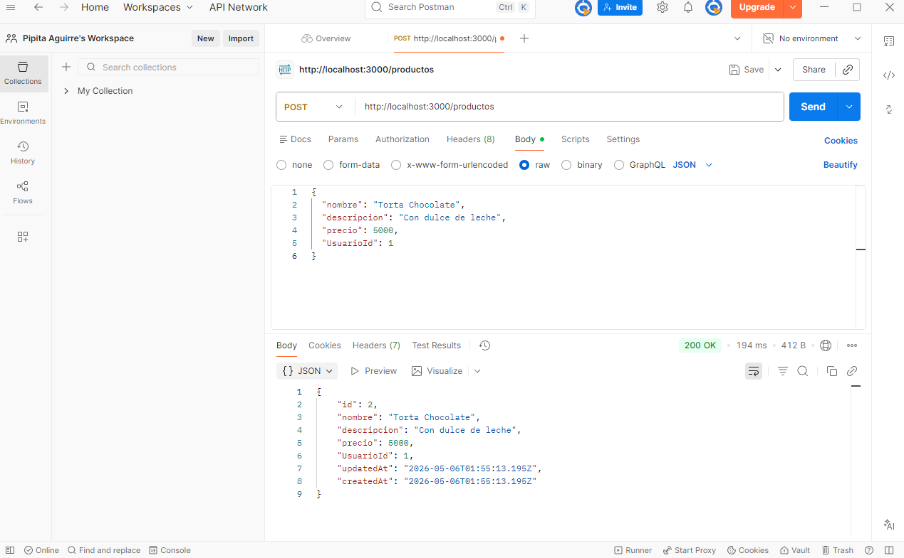

# 🍰✨ API PASTELERÍA ✨🍰

Bienvenida a mi Trabajo Práctico Integrador Final de Back End 💻
Una API REST para gestionar una pastelería con tortas y tartas deliciosas 🧁


## 🎯 Objetivo

Desarrollar una API utilizando Node.js, Express y Sequelize 


## 🧩 Herramientas utilizadas

💻 Node.js
🗄️ MySQL
🔗 Sequelize ORM


## Instalación

````bash
npm init -y
npm install express sequelize mysql2
```

---

```bash
node app.js
```

Servidor en:
👉 http://localhost:3000

---

👤 Usuarios
🍰 Productos (tortas y tartas)

---


Un usuario puede crear muchos productos 

---

🔹 POST /users → Crear usuario
🔹 GET /users → Ver usuarios

---

🔹 GET /products → Ver todos
🔹 GET /products/:id → Ver uno
🔹 POST /products → Crear
🔹 PUT /products/:id → Actualizar ✨
🔹 DELETE /products/:id → Eliminar 🗑️

## 📸 Pruebas en Postman

Las siguientes imágenes muestran pruebas realizadas en Postman para verificar el funcionamiento de la API.

### Ejemplo de creación de usuario



---

### Ejemplo de creación de producto



---

¡Gracias por visitar mi API de pastelería! 🍓🧁✨
